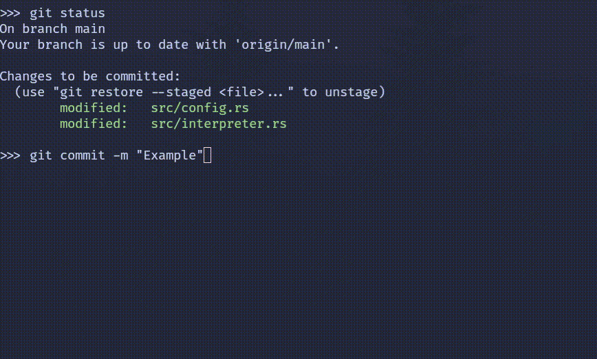

# Commitment

[](https://crates.io/crates/commitment)
[](./LICENSE.txt)

Simplify your Git pre-commit hooks.



## Usage

> **WARNING**
> 
> Commitment files contain arbitrary shell commands. Be cautious when installing
> a Commitment file and always review first!

To use Commitment, start by creating a `commitment.yml` file in the root
directory of your project. See the next section for an example.

Commitment files need to be installed before they take effect. To install a
Commitment file, run `commitment install` in the root of your project.

## Example Commitment File

```yaml
# Tasks are defined below. They run sequentially. If one fails, the following
# tasks are skipped and Commitment returns an error code.
 
cargo-build:
  # You can specify file globs to determine what should be restaged after the
  # task has succeeded. File globs can be specific file paths or patterns such
  # as `*.rs` or `docs/**/*.md`.
  restage:
    # If this is false, only files that were previously staged will be restaged.
    # Otherwise any file, wether staged or not will be staged after the task
    # has succeeded.
    allow-any: true
    globs:
      - Cargo.toml
      - Cargo.lock

  # This must be defined for every task. Multiple commands can be specified and
  # will be executed within the same shell session. This means you can change
  # directories and run commands there.
  execute:
    - cargo build --color=always

cargo-fmt:
  # When present, files with the matching extension will be restaged before
  # the commit is made. In this case, it's used to auto-format the code before
  # each commit.
  restage:
    extensions: ["rs"]
  execute:
    - cargo fmt

cargo-clippy:
  execute:
    - cargo clippy --color=always -- -D warnings

cargo-audit:
  # Setting this to true will allow following tasks to continue and won't reject
  # the commit.
  can-fail: true
  execute:
    - cargo audit
```

## Output

Output from `stdout` and `sterr` is displayed as commands are executed. Line
numbers colored in red mean that the line came from `stderr`.

After all tasks are executed, the results will be displayed like this:

```
╔═══════════════════════════╗
║          RESULTS          ║
╚═══════════════════════════╝

 cargo-build....................SUCCESS
   cargo-fmt....................SUCCESS
cargo-clippy....................SUCCESS
 cargo-audit....................SKIPPED

PASSED: 3/4 (75.00%)
```

Possible statuses are:

| **Status**  | **Description**                                |
|-------------|------------------------------------------------|
| SUCCESS     | The task finished without errors               |
| FAILURE     | The task failed to complete                    |
| SKIPPED     | The task failed, but `can-fail` was `true`     |
| IGNORED     | A previous task has failed and this wasn't run |
